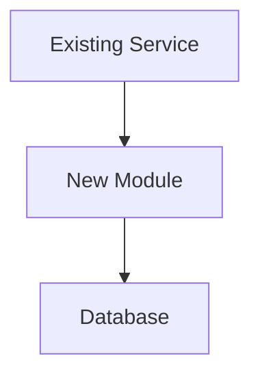

# Agent Coding Guidelines

## Core Principles

1. **Plan before coding** — Use Plan mode for medium+ tasks
2. **Type-level correctness** — Make invalid states irrepresentable
3. **Test thoroughly** — Unit + E2E tests, happy paths + edge cases
4. **Keep it simple** — Readable over clever, explicit over implicit
5. **Clean as you go** — Delete unused code immediately, simplify relentlessly
6. **Minimize dependencies** — Prefer standard library; every external lib is a liability
7. **Document architecture** — Create `ARCHITECTURE_DIFF.md` before PR
8. **Verify before committing** — `make test` must pass (tests + types + lint)
9. **Split large work** — Multiple focused PRs (<500 lines each)
10. **Commit frequently** — One logical change per commit
11. **Branch from main** — Every task gets a fresh branch
12. **DRY** — Search first, reuse and extend existing code
13. **Name every value** — Give constants and thresholds descriptive identifiers
14. **Push and PR** — Every completed branch gets pushed with a PR immediately

**Keep it simple. Commit after every task. Branch from main. Push and PR.**

-----

## 1. Planning

Use Plan mode for multi-file refactors, bug investigations, multi-component changes, anything >30 minutes. Go straight to code only for trivial fixes or explicit unambiguous instructions. When in doubt, plan.

-----

## 2. PR Strategy

Break large work into focused PRs. Each: reviewable in ~15 min, single purpose, <500 lines, all tests pass.

**Workflow:** Identify scope → break into feature-slice chunks → number by merge dependency `[1/N]`, `[2/N]` → for each: branch from main → implement → `make test` → push → create PR → merge → next chunk. Use `[2a/5]`/`[2b/5]` for independent parallel PRs.

**Example:**

```
[1/5] Add user database schema and models (150 lines)
[2/5] Implement auth service with JWT (200 lines)
[3/5] Add login/logout API endpoints (180 lines)
[4/5] Add frontend login UI (220 lines)
[5/5] Add password reset flow (190 lines)
```

-----

## 3. Type-Level Design

Design types so invalid states are unconstructable. Wrap primitives in domain types (`Age` over `Int`, `UserId` over `String`). Use sum types/enums over boolean flags. Reject invalid values at construction time.

**Example:**

```
opaque type Age = Int
object Age:
  inline def apply(inline n: Int): Age =
    inline if n < 0 then error("Age cannot be negative")
    else n

birthday(Age(25))   // works
birthday(Age(-5))   // compile error
```

-----

## 4. Testing

Ship unit + E2E tests covering happy paths and edge cases with every implementation.

**Workflow:** `make test` before changes (baseline) → implement → write/update tests → `make test` after → fix regressions → verify CI locally before pushing. `make test` must include: unit tests, E2E tests, type checking, linting. If incomplete, fix it first.

-----

## 5. Type Checking and Linting

Run on every verification cycle. Compiled languages: strict flags, zero warnings. Interpreted: type checker (mypy/pyright/tsc) + linter (eslint/ruff/clippy), both in `make test`.

```makefile
test:
	npm run typecheck && npm run lint && npm run test:unit && npm run test:e2e
```

-----

## 6. Architecture Documentation

Create `ARCHITECTURE_DIFF.md` in repo root before opening a PR. Include at least one Mermaid diagram (flowchart for components, sequence for data flow, ER for schema). Replace any existing one.

```markdown
# Architecture Diff
## Summary
One-sentence description.
## Diagram(s)

## Changes
### Added / Modified / Removed
- [component]: Why
```

-----

## 7. Code Simplicity (KISS)

Write code a junior developer can understand. One abstraction level per function. Functions under 30 lines, nesting under 3 levels. Let the code speak — if a comment explains *what* it does, rewrite it. Delete dead code, unused imports, commented-out blocks immediately. Prefer boring technology.

-----

## 8. DRY

Every piece of logic has a single authoritative location.

**Before writing:** search the codebase (grep/IDE/AST) → if found, reuse or generalize → if new, place in shared location designed for reuse → consolidate any duplication found during work.

**Rules:** Read before writing. Extend the original module for new behavior. One fact in one place (config, rules, validation, types). Get it right the first time. Shared logic in shared modules.

**Example — shared validation:**

```python
# validation.py — single source of truth
def validate_email(email: str) -> Email:
    if not re.match(r'^[\w.+-]+@[\w-]+\.[\w.]+$', email):
        raise ValueError("Invalid email")
    return Email(email)

# user_api.py / invite_api.py — both call validate_email()
```

**Example — extending an existing module:**

```python
# notifications.py — add priority param to existing function
def send_notification(user_id, message, channel, priority=Priority.NORMAL): ...

def send_urgent_notification(user_id, message):
    for ch in ("sms", "email"):
        send_notification(user_id, message, channel=ch, priority=Priority.URGENT)
```

-----

## 9. Commit Discipline

Each commit = one logical unit of work. Target 1–50 lines, 50–100 acceptable, 100+ rare.

**Every task follows this flow:**

```bash
git checkout main && git pull origin main
git checkout -b <descriptive-branch-name>
# ... work, committing after each logical change ...
make test
git push origin <branch-name>
gh pr create --title "<title>" --body "<description>"
```

Commit after: adding a function, fixing a bug, adding a test, refactoring a component, updating config, changing a dependency. Use multiple `-m` flags for details.

Before pushing: fetch origin, rebase main, resolve conflicts, re-run `make test`. After pushing: create PR immediately. Multi-PR tasks use `[X/N]` in title.

-----

## 10. Code Review

Complete implementation → `make test` → commit/push/PR → fresh Claude session → `/review` with PR link → fix issues → `make test` → push → re-run `/review` if significant changes.

-----

## 11. Minimal Dependencies

Before adding: can it be done in <50 lines? Is it well-maintained with a small dep tree and compatible license? Prefer standard library > single-purpose lib > framework.

-----

## Checklist

- [ ] Fresh branch from main
- [ ] Plan mode used (if medium+ task)
- [ ] Large task split into focused PRs with `[X/N]` merge order
- [ ] Types prevent invalid states
- [ ] Unit + E2E tests (happy path + edge cases)
- [ ] `make test` passes (tests + types + lint)
- [ ] CI verified locally
- [ ] Code is simple, readable, dead code removed
- [ ] Dependencies justified
- [ ] DRY — searched codebase, reused/extended existing code
- [ ] `ARCHITECTURE_DIFF.md` created/removed as needed
- [ ] Commits small, frequent, user prompt(s) in body
- [ ] Branch pushed, PR created with clear title/description
- [ ] Code review in fresh session with `/review`
