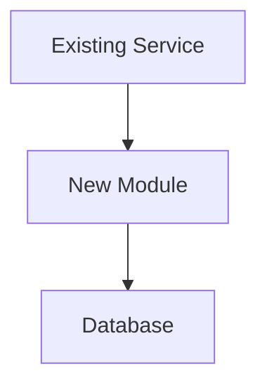

# Agent Coding Guidelines

## Core Principles

1. **Plan before coding** — Use Plan mode for medium and larger tasks
2. **Type-level correctness** — Make invalid states irrepresentable
3. **Test thoroughly** — Unit tests + E2E tests, happy paths + edge cases
4. **Keep it simple** — KISS over clever; readable over compact
5. **Remove dead code** — Delete unused code immediately; simplify relentlessly
6. **Minimize dependencies** — Every external library is a liability
7. **Document architecture changes** — Create ARCHITECTURE_DIFF.md before PR
8. **Verify before committing** — Tests and type checks must pass
9. **Split large work** — Multiple focused PRs over one massive PR
10. **Commit frequently** — Many small commits over few large ones
11. **ALWAYS create a new branch from main before starting new work** — Every new task gets a fresh branch. No working on main directly. No reusing old branches.
12. **DRY — Don't Repeat Yourself.** Don't duplicate existing code "to be safe" and refactor later. Before writing anything new, find the existing implementation first. Reuse it directly and extend only if needed. If a new use case overlaps with existing logic, generalize the existing code rather than duplicating it with slight variations. The "make it work, make it right" two-pass pattern is banned — get it right the first time by reading what's already there. Extend rather than glue new code alongside old code. See [Section 11](#11-dry--dont-repeat-yourself) for full rules.
13. Avoid magic values — name every constant, threshold, or hardcoded literal with a descriptive identifier that makes its purpose self-evident.
14. **Always push and create PRs** — After completing work on a branch, push it to origin and create a PR. Never leave branches local-only.

**DO NOT OVERCOMPLICATE. Ever.**
**ALWAYS COMMIT AFTER FINISHING A TASK.**
**ALWAYS CREATE A NEW BRANCH FROM MAIN IF NOT ON OTHER BRANCH ALREADY. DO NOT PUSH DIRECTLY TO MAIN.**
**ALWAYS PUSH THE BRANCH AND CREATE A PR AFTER COMPLETING WORK.**

---

## 1. Plan Mode First

Use Plan mode for medium and larger tasks before implementing.

**Always use Plan mode for:**
- Medium to large features
- Refactoring involving multiple files
- Bug investigation requiring exploration
- Multi-component changes
- Anything that would take >30 minutes to implement

**Skip Plan mode only for:**
- Trivial changes (typos, single-line fixes)
- Changes with explicit, unambiguous instructions
- Simple, isolated modifications
- **When in doubt, plan**

---

## 2. PR Strategy for Large Tasks

Break large work into comprehensible PRs. One massive PR is a code review nightmare and a deployment risk.

**Workflow for large tasks:**
1. Identify full task scope
2. Break into logical chunks (feature slices, not architectural layers)
3. **Number the PRs in order of merge dependency** — use `[1/N]`, `[2/N]`, etc. in PR titles so reviewers know which PR to merge first
4. For each chunk:
   - Create new branch from main/master
   - Implement chunk completely
   - Ensure `make test` passes
   - Create PR with ARCHITECTURE_DIFF.md if needed
   - **Push the branch and create the PR immediately**
   - **PR title format: `[X/N] <description>` where X is the merge order and N is total PRs**
   - Get review and merge
   - Delete branch
5. Move to next chunk from updated main/master

**PR title examples for multi-PR tasks:**
```
[1/5] Add user database schema and models
[2/5] Implement auth service with JWT
[3/5] Add login/logout API endpoints
[4/5] Add frontend login UI
[5/5] Add password reset flow
```

The numbers indicate **merge order**, not just sequence. `[1/5]` must be merged before `[2/5]`, and so on. If two PRs are independent and can be merged in any order, give them the same number: `[2a/5]` and `[2b/5]`.

**What counts as "comprehensible PR":**
- Reviewable in ~15 minutes
- Single clear purpose
- Roughly <500 lines changed
- All tests pass independently
- Can be deployed independently (when possible)

**Red flags signaling "split this up":**
- PR description says "This PR does X, Y, and Z"
- Touching >5 files with unrelated purposes
- Multiple architecture changes bundled together
- Diff requires scrolling more than 2-3 screens
- Review would take >20 minutes

**Examples:**

**BAD (one massive PR):**
```
PR: "Add user authentication system"
- New auth service
- Database migrations
- Frontend login UI
- API endpoints
- Session management
- Password reset flow
- Email service integration
(2000+ lines changed)
```

**GOOD (split into focused PRs with merge order):**
```
PR 1: "[1/5] Add user database schema and models" (150 lines)
PR 2: "[2/5] Implement auth service with JWT" (200 lines)
PR 3: "[3/5] Add login/logout API endpoints" (180 lines)
PR 4: "[4/5] Add frontend login UI" (220 lines)
PR 5: "[5/5] Add password reset flow" (190 lines)
```

**Benefits:**
- Each PR is reviewable
- Can deploy incrementally (with feature flags if needed)
- Easy to revert specific changes
- Faster review cycles
- Less merge conflict pain
- **Merge order is explicit — no guessing which PR to land first**

---

## 3. Type-Level Design

Design types so invalid states don't compile. If bad data can't be constructed, it can't cause bugs.

**Principles:**
- Wrap primitives in domain types — `Age` over `Int`, `UserId` over `String`
- Use sum types/enums over boolean flags
- Reject invalid values at construction, not at use
- Avoid `any`, `unknown`, or equivalent escape hatches

**Example — prevent invalid states at compile time:**

```
// BAD: accepts negative age — bug compiles fine
def birthday(age: Int): String = s"You are $age"
birthday(-5)  // no error

// GOOD: negative age won't compile
opaque type Age = Int
object Age:
  inline def apply(inline n: Int): Age =
    inline if n < 0 then error("Age cannot be negative")
    else n

def birthday(age: Age): String = s"You are $age"
birthday(Age(25))   // works
birthday(Age(-5))   // compile error: "Age cannot be negative"
```

The pattern: don't validate bad data — make it unconstructable.

---

## 4. Testing Strategy

Every implementation requires both unit tests and E2E tests covering happy paths and edge cases.

**Test coverage requirements:**
- **Unit tests**: Test individual functions/modules in isolation
- **E2E tests**: Test complete user flows and integrations
- **Happy paths**: Expected inputs produce expected outputs
- **Edge cases**: Boundaries, empty inputs, nulls, errors, concurrency

**Workflow:**
1. Run `make test` before changes (baseline)
2. Implement changes
3. Write/update tests for new behavior
4. Run `make test` after changes
5. Fix any regressions
6. **If CI exists, verify CI checks pass locally before pushing**
7. All tests must pass before considering work complete

**All verification runs through `make test`**, which must include:
- Unit tests
- E2E tests
- Type checking (compiler/type checker)
- Linting (for interpreted languages)

If `make test` doesn't exist or doesn't include all checks, fix it first.

---

## 5. Type Checking and Linting

Type checks and linters run on every verification cycle, not as an afterthought.

**For compiled languages:**
- Type checking is part of compilation
- Ensure strict compiler flags are enabled
- Zero warnings policy where feasible

**For interpreted languages:**
- Type checker must run (mypy, pyright, tsc, etc.)
- Linter must run (eslint, ruff, clippy, etc.)
- Both integrated into `make test`

**Configuration examples:**

```makefile
# make test should include everything
test:
	npm run typecheck
	npm run lint
	npm run test:unit
	npm run test:e2e
```

```makefile
test:
	mypy src/
	ruff check src/
	pytest tests/
```

---

## 6. Architecture Documentation
**When architecture changes, create `ARCHITECTURE_DIFF.md` before opening a PR.**
This file documents what changed structurally and why. It exists for review purposes only.

**Rules:**
- Create `ARCHITECTURE_DIFF.md` in the repository root before creating a PR
- If `ARCHITECTURE_DIFF.md` already exists from a previous change, delete it and replace with yours
- Delete `ARCHITECTURE_DIFF.md` before merging the PR (it must not be merged into main)

**What counts as an architecture change:**
- New modules or packages
- Changed directory structure
- New external services or integrations
- Database schema changes
- API contract changes
- New dependencies that affect system design
- Changes to data flow or control flow patterns

**Mermaid diagrams are mandatory wherever they add clarity.** Every `ARCHITECTURE_DIFF.md` must include at least one diagram. Use the appropriate diagram type for the change:
- **Component/module additions or removals:** Use a component diagram or flowchart showing where the new piece fits in the existing system
- **Data flow or control flow changes:** Use a sequence diagram or flowchart showing the before/after flow
- **Database schema changes:** Use an ER diagram showing affected entities and relationships
- **API contract changes:** Use a sequence diagram showing the updated request/response interactions
- **Directory structure changes:** Use a flowchart or graph representing the new layout

If a change touches multiple categories above, include multiple diagrams — one per concern. Do not merge unrelated changes into a single diagram for brevity.

**Template:**
````markdown
# Architecture Diff

## Summary
One-sentence description of what changed.

## Diagram(s)
Include Mermaid diagram(s) here illustrating the change. Pick the diagram type that best fits (flowchart, sequence, ER, component, etc.). Show before/after when the change modifies existing structure.


## Changes

### Added
- [component/module]: Why it was added

### Modified
- [component/module]: What changed and why

### Removed
- [component/module]: Why it was removed
````

---

## 7. Code Simplicity (KISS)

Never overcomplicate. Simple and readable beats clever and compact.

**DO NOT OVERCOMPLICATE.**

**Rules:**
- Write code a junior developer can understand
- One level of abstraction per function
- Avoid premature optimization
- Avoid premature abstraction
- If you need a comment to explain what code does, rewrite the code
- Prefer explicit over implicit
- Prefer boring technology over exciting technology
- **Delete dead code immediately** — unused functions, commented code, obsolete modules
- **Simplify relentlessly** — if you can remove code and keep functionality, do it

**Red flags — stop and simplify if you see:**
- Functions over 30 lines
- More than 3 levels of nesting
- Clever one-liners that require thought to parse
- Abstractions with only one implementation
- "Flexible" code for hypothetical future requirements
- Commented-out code lingering in the codebase
- Unused imports, functions, or modules

---

## 8. Minimal Dependencies

Every external dependency is a liability: security risk, maintenance burden, potential breakage.

**Before adding a dependency, ask:**
1. Can this be implemented in <50 lines of code?
2. Is this a core, well-maintained library (not abandoned)?
3. Does the dependency tree stay small?
4. Is the license compatible?

**Prefer:**
- Standard library over external packages
- Single-purpose libraries over frameworks
- Vendoring small utilities over adding dependencies
- No dependency over any dependency

**Dependency audit:** If a feature requires pulling in 5+ transitive dependencies, reconsider the approach.

---

## 9. Commit Discipline

**Commit early, commit often.** Many small commits beat few large commits.

**Philosophy:**
- Each commit should represent one logical unit of work
- A commit should be small enough to understand in seconds
- If you can describe the commit with "and" in the message, split it
- Frequent commits create a clear history and make debugging easier
- Small commits are easy to revert, cherry-pick, and bisect

**⚠️ MANDATORY: Before starting ANY new task, create a new branch from main. NEVER work directly on main. ⚠️**

**Branching workflow:**

Every new task — no matter how small — starts on a fresh branch from main.

```bash
# ALWAYS do this before starting new work
git checkout main
git pull origin main
git checkout -b <descriptive-branch-name>
```

- Branch name should be short and descriptive: `fix-login-null-check`, `feat-retry-api`, `refactor-session-middleware`
- Never reuse a branch for unrelated work
- Never commit directly to main

**⚠️ MANDATORY: After completing ANY task, you MUST: (1) commit, (2) push the branch, and (3) create a PR. The commit body MUST contain the EXACT user prompt(s) that led to the changes. This is non-negotiable. ⚠️**

**Push and PR workflow — do this after every completed task:**
```bash
# 1. Ensure all tests pass
make test

# 2. Push the branch to origin
git push origin <branch-name>

# 3. Create the PR (using gh CLI)
# For standalone tasks:
gh pr create --title "<descriptive title>" --body "<PR description>"

# For multi-PR tasks, include merge order in title:
gh pr create --title "[X/N] <descriptive title>" --body "<PR description>"
```

**If `gh` CLI is not available**, instruct the user to create the PR manually and provide the branch name and suggested title/body.

**Commit immediately after:**
- Adding a new function or method
- Fixing a single bug
- Adding or updating a test
- Refactoring a single component
- Updating configuration
- Adding/removing a dependency
- Any change that compiles/passes linting

**Do NOT batch these together:**
```bash
# BAD: One commit with multiple unrelated changes
git commit -m "Add user service, fix login bug, update tests, refactor utils"

# GOOD: Separate commits for each logical change
git commit -m "Add UserService with createUser method"
git commit -m "Fix null pointer in login validation"
git commit -m "Add tests for UserService.createUser"
git commit -m "Extract date formatting to DateUtils"
```

**Ideal commit size:**
- 1-50 lines changed is ideal
- 50-100 lines is acceptable for cohesive changes
- 100+ lines should be rare and justified
- If a commit touches more than 2-3 files, question whether it should be split

**Before each commit:**
1. Run `make test` (or at minimum, ensure code compiles/lints)
2. Review the diff — does it represent ONE logical change?
3. Write a clear, specific commit message

**Before pushing (if on feature branch):**
1. Fetch latest changes from origin
2. Rebase or merge main/master into your branch
3. Resolve all conflicts
4. Re-run `make test` after resolving conflicts
5. Push all commits

**After pushing:**
1. Create a PR immediately — do not leave pushed branches without PRs
2. For multi-PR tasks, include `[X/N]` merge order in the PR title
3. Add a clear PR description explaining what changed and why

**Commit message format:**

```bash
# Simple commits (the norm)
git commit -m "Add user authentication endpoint"
git commit -m "Fix off-by-one error in pagination"
git commit -m "Remove unused UserHelper class"

# With details when necessary (use multiple -m flags, not heredocs)
git commit -m "Fix race condition in cache invalidation" -m "The previous implementation could serve stale data when concurrent requests triggered invalidation. Now using mutex to serialize cache updates."
```

**Never use heredocs in commit commands** — they fail in sandboxed environments.

**Red flags — you're committing too infrequently if:**
- You have 500+ lines of uncommitted changes
- You've been working for 30+ minutes without a commit
- Your commit message needs multiple sentences to describe what changed
- You're afraid to commit because "it's not done yet" (commit with WIP prefix if needed)
- You lose work because of uncommitted changes
- **You finished a task and did NOT commit with the user's exact prompt(s) in the body — this is a violation of the core principles**
- **You finished a task and did NOT push the branch and create a PR — this is a violation of the core principles**

---

## 10. Code Review

Review all non-trivial PRs in a fresh session. Apply the same standards to AI-generated and human code.

**Workflow:**
1. Complete implementation
2. Ensure `make test` passes
3. Commit and push to branch
4. Create PR
5. Start fresh Claude session
6. Run `/review` with PR link
7. Fix all issues identified by review
8. Run `make test` to verify fixes
9. Push changes to same branch (updates PR automatically)
10. Re-run `/review` if significant changes made

---

## 11. DRY — Don't Repeat Yourself

Every piece of knowledge must have a single, authoritative representation in the codebase. Duplication is how bugs breed — fix one copy, miss the other, ship a regression.

**DO NOT DUPLICATE. Extend what exists.**

**Rules:**
- **Read before writing.** Before implementing anything, search the codebase for existing logic that overlaps. Use grep, IDE search, AST search — whatever it takes. If you didn't search, you don't know it doesn't exist.
- **Reuse directly, extend if needed.** When existing code covers 80% of your use case, generalize it to cover 100%. Do not copy it into a new file and tweak.
- **Extend rather than glue.** If a module needs new behavior, add it to the module. Do not write a wrapper, adapter, or "helper" that calls into the original and patches on differences. The original should grow to handle the new case.
- **One fact, one place.** Configuration values, business rules, validation logic, type definitions, error messages — each lives in exactly one place. Everything else references that place.
- **No "temporary" duplication.** The "I'll duplicate now and refactor later" pattern is banned. Later never comes. Get it right the first time.
- **Shared logic goes in shared modules.** If two components need the same logic, extract it once into a shared location. Do not let both components maintain their own copy.

**Workflow before writing new code:**
1. Identify what the new code needs to do
2. Search the codebase for existing implementations of the same or similar logic
3. If found: reuse directly, or generalize the existing code to cover the new case
4. If not found: implement it once, in the right place, designed for reuse from the start
5. If you find duplicates during any work: consolidate them immediately — don't leave them for a follow-up

**Examples:**

**BAD — duplicated validation:**
```python
# user_api.py
def create_user(email: str):
    if not re.match(r'^[\w.+-]+@[\w-]+\.[\w.]+$', email):
        raise ValueError("Invalid email")
    ...

# invite_api.py
def send_invite(email: str):
    if not re.match(r'^[\w.+-]+@[\w-]+\.[\w.]+$', email):
        raise ValueError("Invalid email")
    ...
```

**GOOD — single source of truth:**
```python
# validation.py
def validate_email(email: str) -> Email:
    if not re.match(r'^[\w.+-]+@[\w-]+\.[\w.]+$', email):
        raise ValueError("Invalid email")
    return Email(email)

# user_api.py
def create_user(email: str):
    validated = validate_email(email)
    ...

# invite_api.py
def send_invite(email: str):
    validated = validate_email(email)
    ...
```

**BAD — gluing a wrapper around existing code:**
```python
# existing: notifications.py
def send_notification(user_id: str, message: str, channel: str): ...

# new file: urgent_notifications.py  ← DON'T DO THIS
def send_urgent_notification(user_id: str, message: str):
    """Wrapper that adds priority flag."""
    enriched = f"[URGENT] {message}"
    send_notification(user_id, enriched, channel="sms")
    send_notification(user_id, enriched, channel="email")
```

**GOOD — extend the existing module:**
```python
# notifications.py (extended)
def send_notification(
    user_id: str,
    message: str,
    channel: str,
    priority: Priority = Priority.NORMAL,
): ...

def send_urgent_notification(user_id: str, message: str):
    """Urgent notifications go to both SMS and email."""
    for ch in ("sms", "email"):
        send_notification(user_id, message, channel=ch, priority=Priority.URGENT)
```

**Red flags — stop and deduplicate if you see:**
- Copy-pasting a function or block and changing a few lines
- Two modules with near-identical logic for "slightly different" use cases
- The same constant, regex, or config value defined in multiple places
- A "utils" or "helpers" file that shadows logic already in a domain module
- A new file whose name is suspiciously close to an existing file (`user_service.py` and `user_service_v2.py`)
- Wrapper functions that add trivial behavior around existing functions instead of extending the original
- Test helpers that reimplement logic already available in the production code

**When you find existing duplication during other work:**
- If the duplication is in files you're already touching: fix it now, in the same PR
- If the duplication is elsewhere: create a separate PR to consolidate, file it immediately, do not ignore it

---

## Summary Checklist

Before marking any task complete:

- [ ] **New branch created from main before starting work — NOT working on main directly**
- [ ] Plan mode used (if medium/large task)
- [ ] Large task split into focused PRs (<500 lines each)
- [ ] **Multi-PR tasks use `[X/N]` merge order in PR titles**
- [ ] Type-level design prevents invalid states
- [ ] Unit tests written (happy path + edge cases)
- [ ] E2E tests written (happy path + edge cases)
- [ ] `make test` passes (tests + types + lint)
- [ ] CI checks verified locally before push (if CI exists)
- [ ] Code is simple and readable
- [ ] Dead code removed, code simplified
- [ ] No unnecessary dependencies added
- [ ] **No duplicated logic — reused and extended existing code (DRY)**
- [ ] **Searched codebase for existing implementations before writing new code**
- [ ] `ARCHITECTURE_DIFF.md` created (if architecture changed)
- [ ] Commits are small and frequent (not batched)
- [ ] **Every commit body contains the exact user prompt(s) that triggered the work — VERBATIM**
- [ ] **Branch pushed to origin**
- [ ] **PR created with clear title and description**
- [ ] Code review completed in fresh session with /review
- [ ] Review issues fixed and pushed to branch
- [ ] Branch updated with latest main/master (if on feature branch)
- [ ] `ARCHITECTURE_DIFF.md` removed before merge (if created)
