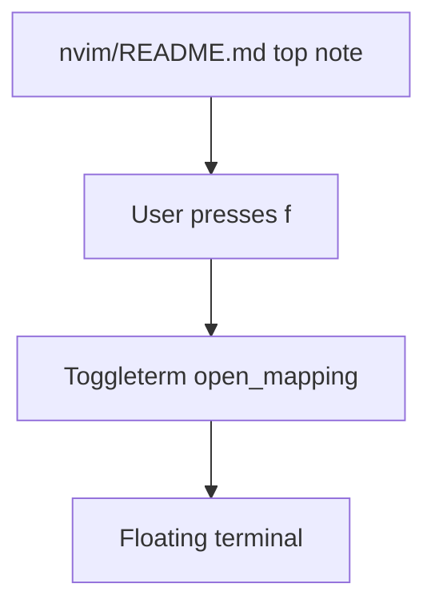

# Architecture Diff

## Summary
Change the Neovim floating terminal shortcut from `<leader>j` to `<leader>f` and update the top README shortcut note.

## Diagram(s)

## Changes

### Modified
- `nvim/lua/plugins/tools.lua`: Sets the shared Toggleterm floating terminal mapping value to `<leader>f`.
- `nvim/README.md`: Documents the floating terminal shortcut at the top of the README.
