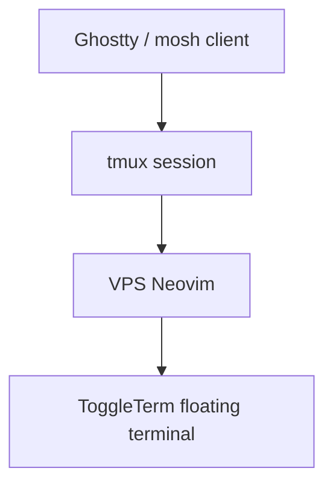

# Architecture Diff

## Summary
Route the VPS Neovim floating terminal through a transport-safe leader mapping and enable tmux extended key forwarding.

## Diagram(s)

## Changes
### Added
- `tmux/.tmux.conf`: Enable `extended-keys` with xterm formatting for richer modified-key forwarding through tmux.
- `ARCHITECTURE_DIFF.md`: Document this configuration change.

### Modified
- `nvim-vps-linux/lua/core/keymaps.lua`: Map `Space j` to `ToggleTerm` in normal, insert, and terminal modes for a VPS-safe floating terminal shortcut.

### Removed
- None.
