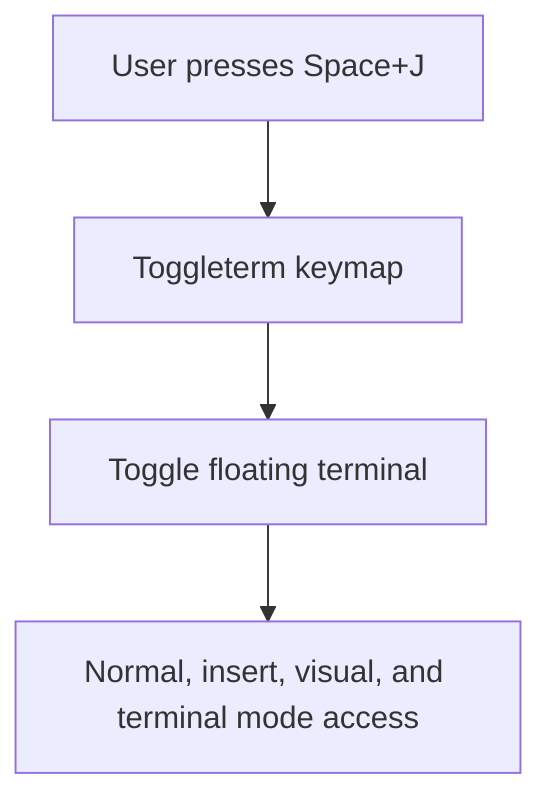

# Architecture Diff
## Summary
Change the macOS Neovim floating terminal shortcut from Cmd+F to Space+J across editor modes.
## Diagram(s)

## Changes
### Modified
- `nvim/lua/plugins/tools.lua`: Replaces the Toggleterm open mapping with a named `<leader>j` key and adds explicit insert, visual, and terminal mode mappings.
